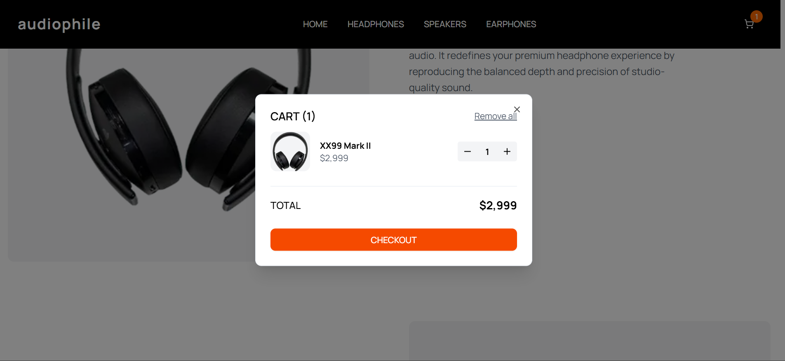

# 🎧 Audiophile E-Commerce Website

A premium audio equipment e-commerce website built with modern web technologies, featuring a sleek design and seamless shopping experience.


## 🌟 Features

### 🛍️ **Complete E-Commerce Experience**

- **Product Catalog** - Browse headphones, speakers, and earphones
- **Product Details** - Comprehensive product pages with image galleries
- **Shopping Cart** - Add, remove, and manage items with persistent storage
- **Checkout Process** - Complete order flow with form validation
- **Responsive Design** - Optimized for mobile, tablet, and desktop

### ⚡ **Performance & Technology**

- **Next.js 15** - Latest React framework with App Router
- **TypeScript** - Full type safety and developer experience
- **Tailwind CSS** - Utility-first CSS framework for rapid styling
- **shadcn/ui** - High-quality, accessible UI components
- **Local Storage** - Persistent shopping cart across sessions

## 🚀 Live Demo

**[View Live Website →](https://audiophileecommerce2.netlify.app/)**

## 📱 Screenshots

### Desktop View



### Mobile View


## 🛠️ Tech Stack

| Technology       | Purpose         | Version |
| ---------------- | --------------- | ------- |
| **Next.js**      | React Framework | 15.3.3  |
| **TypeScript**   | Type Safety     | 5.2.2   |
| **Tailwind CSS** | Styling         | 4       |
| **shadcn/ui**    | UI Components   | Latest  |
| **Lucide React** | Icons           | 0.263.1 |

## 📦 Installation

### Prerequisites

- Node.js 18+
- npm or yarn package manager

### Setup Instructions

1. **Clone the repository**

   ```bash
   git clone https://github.com/nyarko-i/ecommerce.git
   cd ecommerce
   ```

2. **Install dependencies**

   ```bash
   npm install

   # or

   yarn install
   ```

3. **Add product images**

   ```
   public/images/
   ├── hero/headphones-hero.png
   ├── about/person-headphones.png
   ├── categories/[category-images]
   ├── products/[product-images]
   └── gallery/[gallery-images]
   ```

4. **Run development server**

   ```bash
   npm run dev

   # or

   yarn dev
   ```

5. **Open in browser**
   ```
   http://localhost:3000
   ```

## 🏗️ Project Structure

```
audiophile-ecommerce/
├── app/ # Next.js App Router pages
│ ├── (routes)/ # Route groups
│ ├── globals.css # Global styles
│ └── layout.tsx # Root layout
├── components/ # React components
│ ├── ui/ # shadcn/ui components
│ ├── loading/ # Loading skeletons
│ └── [feature-components]
├── contexts/ # React contexts
├── hooks/ # Custom React hooks
├── lib/ # Utilities and data
│ ├── data/ # Static data (products.json)
│ └── utils/ # Utility functions
├── types/ # TypeScript type definitions
└── public/ # Static assets
└── images/ # Product and UI images
```

## 🎯 Key Features Breakdown

### 🏠 **Homepage**

- Hero section with featured product
- Product showcase with call-to-action buttons
- Category navigation grid
- About section with company information

### 📱 **Product Pages**

- Detailed product information and specifications
- Image galleries with multiple views
- Quantity selection and add-to-cart functionality
- Related product recommendations

### 🛒 **Shopping Cart**

- Persistent cart using localStorage
- Quantity management (increase/decrease/remove)
- Real-time price calculations
- Smooth modal interactions

### 💳 **Checkout Process**

- Comprehensive billing and shipping forms
- Payment method selection (e-Money/Cash on Delivery)
- Form validation with error handling
- Order confirmation with summary

### 📱 **Responsive Design**

- Mobile-first approach
- Breakpoints: Mobile (default), Tablet (768px+), Desktop (1024px+)
- Touch-friendly interface elements
- Optimized typography and spacing

## 🎨 Design System

### **Colors**

- **Primary Orange**: `#D87D4A` - Call-to-action buttons and accents
- **Dark**: `#000000` - Headers and primary text
- **Gray**: `#F1F1F1` - Backgrounds and secondary elements
- **White**: `#FFFFFF` - Main background and contrast

### **Typography**

- **Font Family**: Manrope (Google Fonts)
- **Weights**: 400 (Regular), 500 (Medium), 600 (Semi-bold), 700 (Bold)
- **Responsive Scale**: Mobile-first with larger sizes on desktop

### **Spacing**

- **Base Unit**: 4px (Tailwind's spacing scale)
- **Container**: Max-width with responsive padding
- **Sections**: Consistent vertical rhythm

## 🔧 Development

### **Available Scripts**

```bash
npm run dev # Start development server
npm run build # Build for production
npm run start # Start production server
npm run lint # Run ESLint
```

### **Code Quality**

- **ESLint** - Code linting and formatting
- **TypeScript** - Static type checking
- **Prettier** - Code formatting (recommended)

### **Performance Optimizations**

- **Next.js Image Optimization** - Automatic image optimization
- **Static Generation** - Pre-built pages for better performance
- **Code Splitting** - Automatic code splitting by Next.js
- **Loading States** - Skeleton screens for better perceived performance

## 🚀 Deployment

This project is optimized for deployment on:

### **Vercel**

```bash
npm i -g vercel
vercel
```

### **Netlify**

```bash
npm run build

# Upload dist folder to Netlify

```

### **Other Platforms**

- Build command: `npm run build`
- Output directory: `.next`
- Node.js version: 18+

## 👨‍💻 Author

**Isaac Nyarko**

- GitHub: [nyarko-i](https://github.com/nyarko-i)

## 🙏 Acknowledgments

- **UI Components**: shadcn/ui component library
- **Icons**: Lucide React icon library
- **Fonts**: Google Fonts (Manrope)

## 📈 Future Enhancements

- [ ] User authentication and accounts
- [ ] Product reviews and ratings
- [ ] Wishlist functionality
- [ ] Payment gateway integration
- [ ] Admin dashboard for product management
- [ ] Search and filtering capabilities
- [ ] Email notifications
- [ ] Multi-language support

---

<div align="center">

**⭐ Star this repository if you found it helpful!**

[Live Demo](https://audiophileecommerce2.netlify.app/) •

</div>
